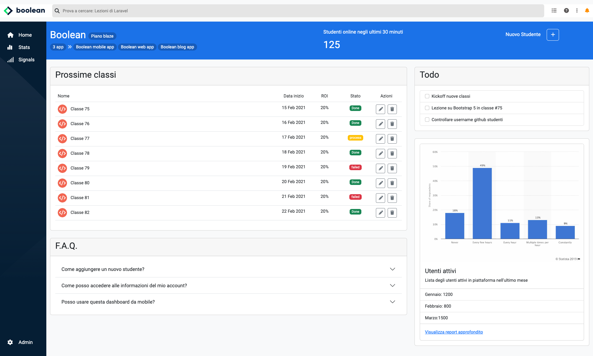

# Bootstrap Dashboard

> Esercizio Bootstrap Dashboard

## Ricreiamo il layout responsive di una dashboard

- Descrizione
  - Ricreiamo il layout responsive di una dashboard, ovvero il pannello di controllo di una ipotetica applicazione web, seguendo gli screenshot allegati.
  La richiesta è realizzarlo utilizzando Bootstrap 5.
  Teniamo sempre sotto mano la documentazione della libreria per usare le caratteristiche principali nel modo corretto.
  Potrebbero tornarci utili anche classi helper, utilities etc.
  Avrete due giorni per completare il layout, come sempre partite dall'analisi delle macroaree.
  Di questo cercate anche di capire cosa è uguale o molto simile e quindi realizzabile una volta per poi essere riciclato, ottimizzando tempo e codice.

* Consigli

  - Ricordiamo che lavorando in responsive ogni blocco e sezione va pensato in quell'ottica da subito.

  - Tenete un approccio ordinato ma non strafate anche con l'ottimizzazione durante il primo sviluppo di ogni blocco. Prima di passare al prossimo potete sempre tornarci e ripulire/ottimizzare/aggiustare. Soprattutto in ottica di riciclo, questo approccio, sul lungo termine vi farà risparmiare tempo.

  - Questa volta essendo un layout composto da vari componenti, concentriamoci a portare a termine sezione per sezione anche in formato responsive, quando una macroarea funziona allora passiamo alla successiva.
  
  - L'ordine di sviluppo dei blocchi lo possiamo decidere anche in ottica di ottimizzazione.
  Partite comunque sempre semplici e fate un passo alla volta.
  Come sempre cercate di capire quello che state facendo, cercate di finirlo ma non puntate a finirlo a tutti i costi, se ciò vuol dire non capirci più nulla.

  - Ricordiamo anche che Bootstrap ha già molti componenti pronti all'uso che potete utilizzare direttamente come sono (as-is) o con qualche personalizzazione (customized). Molti li avete già usati, altri li trovate come sempre nella documentazione ufficiale del framework.
  Ogni volta che volete usare un componente di Bootstrap fate sempre una prova su un altro file, copiate il codice di esempio dalla documentazione, osservate il comportamento, e solo quando siete sicuri che tutto funzioni come volete, integratelo nel vostro layout.
  Così facendo il codice CSS custom che scriverete risulterà abbastanza ridotto.
